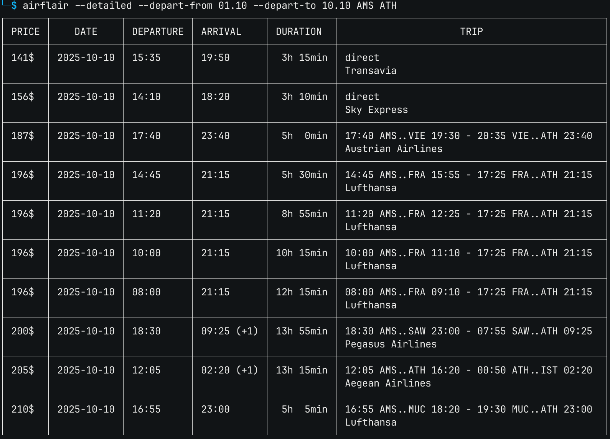

# airflair

Airflair is a tool which considerably streamlines searching for airfare.



Specifically, it enables searching in a variety of ways which are either too cumbersome or impossible to do with conventional services such as Google Flights, Skyscanner etc.

- One-way flights over a range of dates.
- Round-trip flights over a range of departure dates and a range of return dates.
- Multi-leg trips, where multiple destinations can be chained, staying at each one for a number of days.

Currently the data source is the [Skiplagged](https://skiplagged.com/) API. More may be added in the future for redundancy.


## Installation

Binaries are available at [releases](https://github.com/haath/airflair/releases).

Building from source is trivial, assuming you have [Haxe](https://haxe.org/) installed.

```
apt-get install -yqq build-essential g++
haxelib install --always build.hxml
haxe build.hxml
```


## Usage

This tool works with IATA 3-letter airport codes. If unsure about what airport codes correspond to a location, start with the `airflair search` command.

```
$ airflair search washington
WAS: All Airports - Washington, District of Columbia
BWI: Baltimore/Washington Intl Thurgood Marshall - Baltimore, MD
DCA: Ronald Reagan Washington National - Washington, District of Columbia
```

All flight searches typically follow the following pattern.

```sh
$ airflare <options> <dates> [ORIGIN] [DESTINATION]
```

- **`<options>`** may be a series of filters used to narrow down the search, such as `--direct`, `--max-stops N` and so on.
- **`<dates>`** may be either `--depart DATE` or `--depart-from DATE --depart-to DATE` for an one-way trip search. Adding `--return DATE` or `--return-from DATE --return-to DATE` will instead perfom a round-trip flight search.

For all the available options consult `airflare --help`


### Multi-leg trips

Multi-leg flight searches are performed by chaining more than two airport codes.

```sh
$ airflare [ORIGIN] [DEST 1] <stay> [DEST 2] <stay> [DEST 3] ...
```

- The flight from `[ORIGIN]` to `[DEST 1]` will be on the date specified by `--depart`.
- Any additional destination must be preceeded by a stay `<stay>` option, which is one of:
  - `--stay N`: stay for a number of days
  - `--until DATE`: stay until a specific date
- Any additional destination may also be preceeded by the `--transfer` flag. This flag indicates that a self-transfer will be performed from one airport to the next, so no flight search will be done for that leg. This can be useful if a trip might include some travel via train or bus.
- The `--return` options are **invalid** for multi-leg trips. The trip ends at the final destination in the sequence.


## Dates

The following date formats are supported:

* `YYYY-MM-DD`
* `DD.MM` (current year)
* `YYYYMMDD`
* `DD.MM.YYYY`
* `MM-DD` (current year)
* `DD/MM/YYYY`
* `DD/MM` (current year)


## Currencies

The default currency is USD.

To change the currency used set the following two environment variables:

- `AIRFLAIR_DEFAULT_CURRENCY`: set to one of the supported currencies
  - USD
  - EUR
- `FREECURRENCYAPI_KEY`: an API key for [freecurrencyapi.com](https://freecurrencyapi.com/) (free)


## Examples

One-way trips from Amsterdam to Athens in the first two weeks of March

```
$ airflair AMS ATH --depart-from 01.03 --depart-to 15.03
```

Round-trips from Amsterdam to Athens on specific dates

```
$ airflair AMS ATH --depart 01.03 --return 12.03
```

Round-trips with a specific departure date, but a variety of return dates

```
$ airflair AMS ATH --depart 01.03 --return-from 05.03 --return-to 08.03
```

Round-trips spanning a specified number of days

```
$ airflair AMS ATH --depart-from 01.03 --depart-to 03.03 --days 5
```

```
$ airflair AMS ATH --depart 01.03 --days-from 5 --days-to 7
```

Multi-leg trip: travel from Amsterdam to Athens on the first weekend in March, stay for 5 days, then travel to Warsaw, and on the 12th return to Amsterdam

```
$ airflair AMS --depart-from 01.03 --depart-to 03.03 \
           ATH --stay 5 \
           WAW --until 12.03 \
           AMS
```
